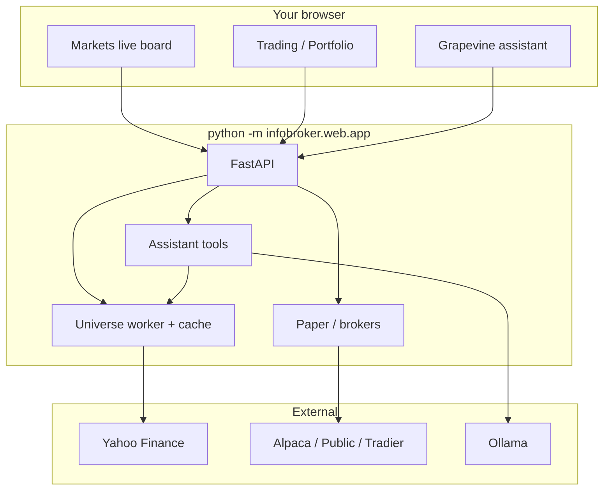
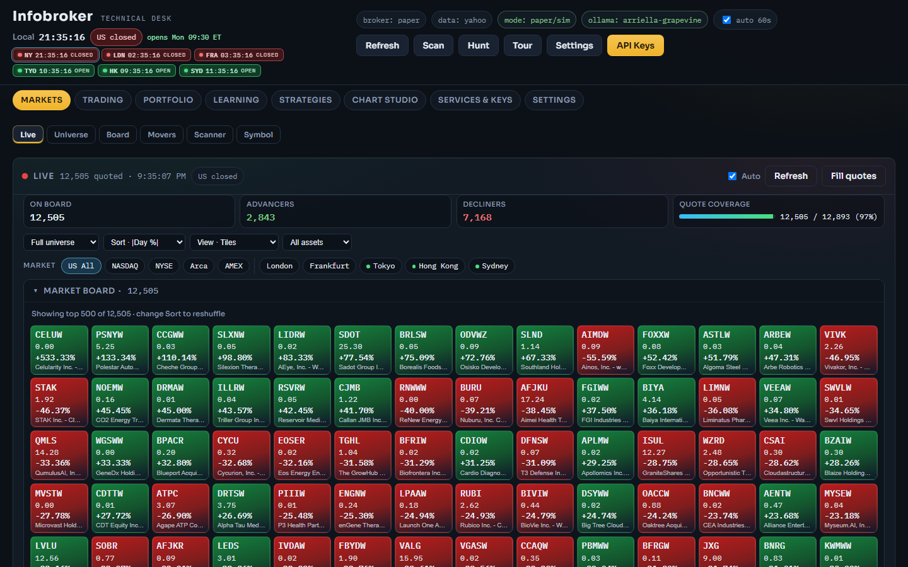
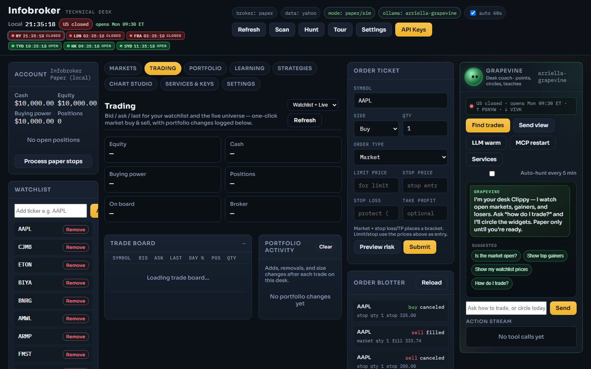
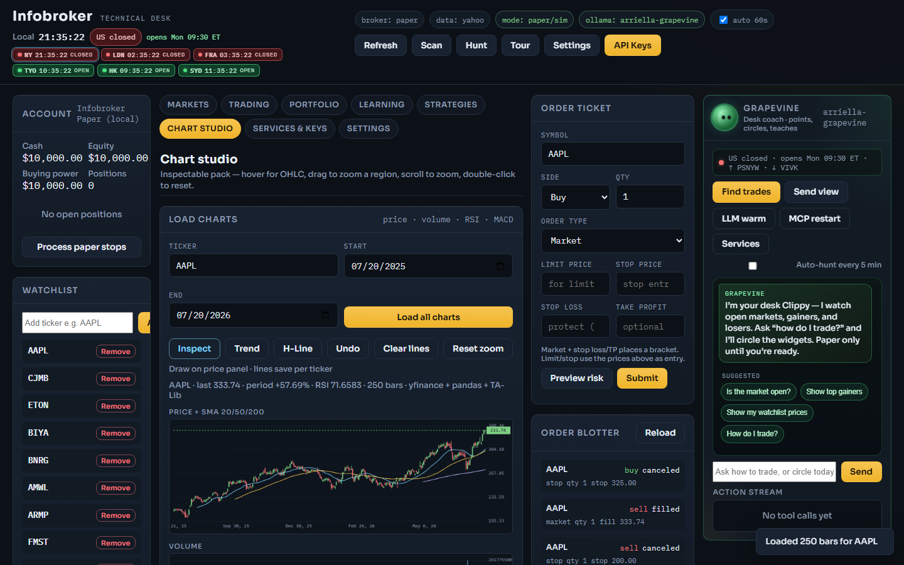
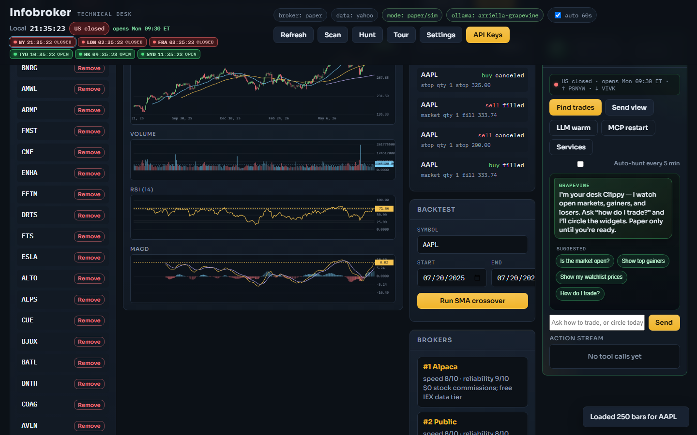
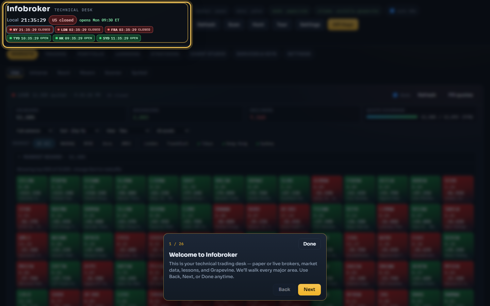
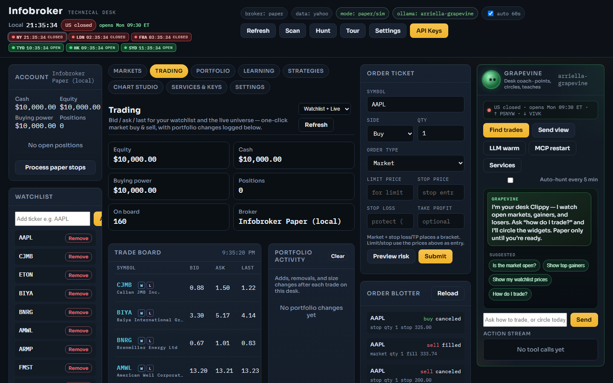

# Infobroker

**Local trading desk** — learn chart & risk skills, research US equities, paper trade, then connect free broker APIs when ready.

[](LICENSE)
[Donate via PayPal](https://www.paypal.com/donate/?hosted_button_id=2RXWCC28FJ79N)

---

## Why this repo

Infobroker is not just a yfinance script. It ships a full **desk UI** with:

- A market **universe cache** so the board stays usable without burning Yahoo rate limits  
- **Paper trading** by default (no keys)  
- **Grapevine** — local Ollama coach with tools, follow-up chips, and closed-market prices  
- Lessons, strategies, chart studio, MCP bridge for Cursor  

## Quick setup (recommended)

### Windows

```powershell
git clone https://github.com/unaveragetech/Infobroker.git
cd Infobroker
powershell -ExecutionPolicy Bypass -File .\setup.ps1
.\.venv\Scripts\Activate.ps1
python -m infobroker.web.app
```

Open **http://127.0.0.1:8000/** — then click **Tour** in the top bar to get oriented. Full walkthrough: [docs/USAGE.md](docs/USAGE.md).

### macOS / Linux

```bash
git clone https://github.com/unaveragetech/Infobroker.git
cd Infobroker
bash setup.sh
source .venv/bin/activate
python -m infobroker.web.app
```

Open **http://127.0.0.1:8000/** and start with **Tour**. See [docs/USAGE.md](docs/USAGE.md).

The setup script:

1. Creates `.venv`  
2. Upgrades pip and installs `requirements.txt`  
3. Copies `.env.example` → `.env` if you don’t already have one  
4. Ensures a `data/` folder exists  

**Never commit `.env`.** Put API keys only in local `.env` or the desk **API Keys** modal.

### Grapevine (highly advised)

The desk coach was **designed for Grapevine**. Install Ollama, then:

```bash
ollama pull arriella-grapevine
```

If you use another model, it should support **chat completion**, **image summary**, **image → text**, **thinking** (multi-step tool plans), and **reductive** (short) output. Details: [docs/USAGE.md](docs/USAGE.md#model-grapevine-strongly-recommended).

Without Ollama, the desk still works; fast-path answers (prices, gainers, cash) keep working.

### Optional: TA-Lib note

TA-Lib is required for indicators. On Windows, `pip` usually installs a wheel. On macOS/Linux you may need the system library first (`brew install ta-lib`, etc.).

---

## How the system works



**Closed market ≠ no prices.** Last quotes live in the universe cache (`as_of` timestamps). See [docs/DATA.md](docs/DATA.md) and [docs/RATE_LIMITS.md](docs/RATE_LIMITS.md).

Full architecture diagrams: [docs/ARCHITECTURE.md](docs/ARCHITECTURE.md).

---

## After you run it

1. Open the desk → click **Tour** (do this first)  
2. Pull **Grapevine** on Ollama if you want the full coach experience  
3. Read [docs/USAGE.md](docs/USAGE.md) for tab insights, closed-market prices, and model requirements  

### Demo video

Short walkthrough of Markets → Chart studio (AAPL pack) → Tour → Trading / Grapevine (~1 min):

<video controls width="100%" poster="docs/images/desk-charts.png">
  <source src="docs/demo.mp4" type="video/mp4" />
</video>

[Watch / download demo.mp4](docs/demo.mp4) · re-record with desk running: `python scripts/record_demo.py`

### UI screenshots

<details>
<summary><strong>Show screenshots</strong> — Markets, Trading, Chart studio, Tour, Grapevine</summary>

<br/>

**Markets** — live board and universe



**Trading** — bid / ask board



**Chart studio** — price + SMA (AAPL)



**Chart studio** — volume · RSI · MACD



**Guided tour** — click **Tour** after you start the desk



**Grapevine** — desk coach



</details>

---

## Documentation

| Doc | What it covers |
|-----|----------------|
| [docs/USAGE.md](docs/USAGE.md) | **Tour-first usage, UI screenshots, Grapevine / model requirements** |
| [docs/README.md](docs/README.md) | Doc index |
| [docs/ARCHITECTURE.md](docs/ARCHITECTURE.md) | Stack + mermaid diagrams |
| [docs/DATA.md](docs/DATA.md) | Market data pipeline |
| [docs/RATE_LIMITS.md](docs/RATE_LIMITS.md) | Quotas & avoidance strategies |
| [docs/BROKERS.md](docs/BROKERS.md) | Brokers + data providers |
| [docs/MCP.md](docs/MCP.md) | Grapevine + Cursor MCP |
| [DONATE.md](DONATE.md) | Support the project |
| [LICENSE](LICENSE) | SDUC License v1.1 |

In the running desk: **Settings → Docs** (same catalog via `/api/docs`).

---

## Free stack

| Layer | Choice |
|-------|--------|
| Execution | **paper** (default) → Alpaca → Public → Tradier |
| Data | **yfinance / Yahoo** → Finnhub → Alpha Vantage |
| Analysis | pandas + TA-Lib |
| Assistant | Ollama `arriella-grapevine` (optional) |

---

## Desk features

- **Markets** — live board, universe, movers, scanner, symbol; world clocks  
- **Trading** — bid/ask + quick buy/sell  
- **Portfolio** — equity, positions, orders, auto-track gainers  
- **Learning** — tutor, journal, skill lessons  
- **Strategies / Chart studio** — free backtests and OHLC packs  
- **Services & keys** — Ollama, MCP, acquire keys  
- **Settings** — docs, about, **donate**  
- **Grapevine** — prices when closed, hunt, follow-up chips, light coach overlays  

---

## Manual setup (no script)

```bash
python -m venv .venv
# Windows: .venv\Scripts\activate
# Unix:    source .venv/bin/activate
pip install -r requirements.txt
cp .env.example .env   # Windows: copy .env.example .env
python -m infobroker.web.app
```

CLI entrypoint (optional): `python -m infobroker`

OpenAPI: http://127.0.0.1:8000/docs

---

## Safety

- Default broker is **paper**  
- Never commit `.env`, ledgers, or `users.json`  
- Public.com Individual API is **live** — practice in paper first  
- Grapevine paper tools refuse live fills  

---

## Attribution

This project is licensed under the **SDUC License v1.1** (source-available, fair-code — not OSI open source).  

Credit: **Tcoder-beelzebub** and **The Infi Dev Team**  
Canonical text: [`LICENSE`](LICENSE) · [unaveragetech gist](https://gist.github.com/unaveragetech/a29c048c8b1ccad062066507bf183d9e)

## Support

If Infobroker helps you: **[Donate via PayPal](https://www.paypal.com/donate/?hosted_button_id=2RXWCC28FJ79N)** · details in [DONATE.md](DONATE.md)
