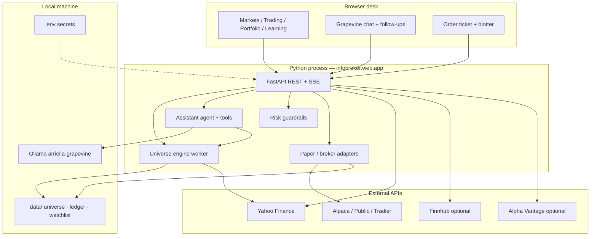
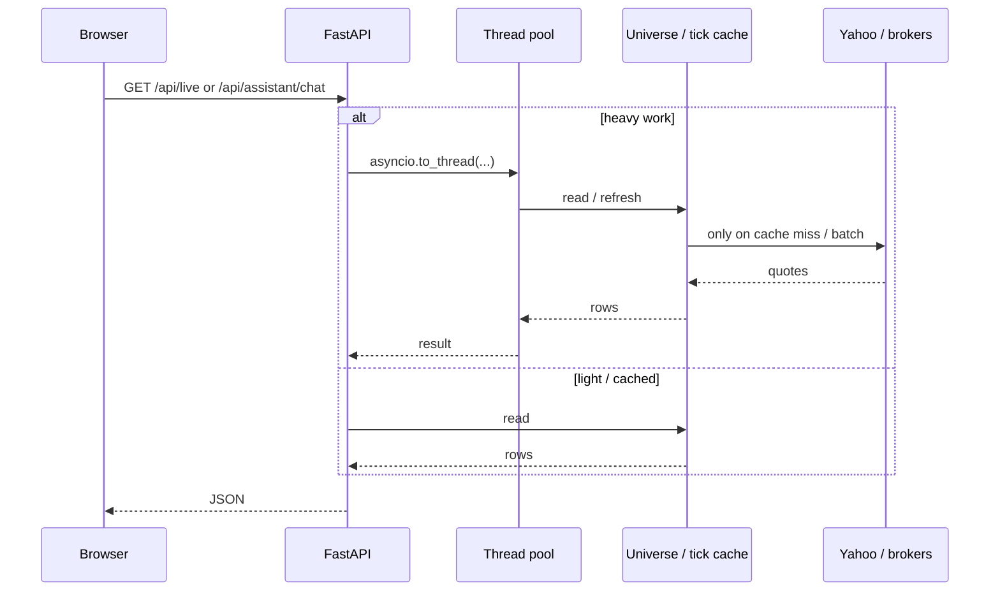
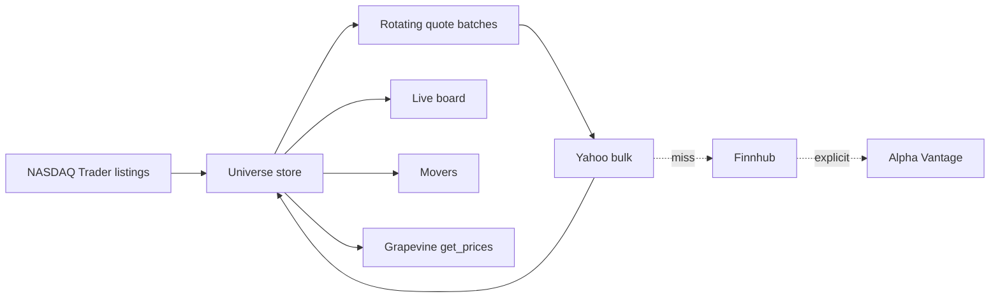

# Architecture

Infobroker is a **local-first trading desk**: FastAPI + static UI, a universe quote cache, optional brokers, and a Grapevine (Ollama) assistant.

Also in the desk: **Settings → Docs**.

## Full stack



## Desk request path



## Data plane



## Package layout

```
infobroker/
  assistant/       # Grapevine agent, tools, desk snapshot, follow-ups
  brokers/         # paper, alpaca, public, tradier (+ optional adapters)
  data/            # yfinance pipeline, highlights, multisource live board
  universe/        # listings + quote cache engine
  markets/         # session clocks, foreign proxy boards, live ticks
  risk/            # pre-trade checks
  education/       # lessons, tutor, trade stories
  strategies/      # backtests + scanner
  services/        # Ollama / MCP process control
  web/             # FastAPI desk + static UI
  portfolio.py
  trading_board.py
  auto_track.py
  docs_catalog.py
  mcp_server.py
  cli.py
docs/              # Markdown reference (+ Settings → Docs)
data/              # runtime only (gitignored)
```

## Desk surface

| Tab | Purpose |
|-----|---------|
| Markets | Live board, universe, movers, scanner, symbol |
| Trading | Bid/ask board + quick buy/sell |
| Portfolio | Equity, positions, orders, auto-track |
| Learning | Tutor, journal, lessons |
| Strategies / Chart studio | Free yfinance backtests and OHLC packs |
| Services & keys | Ollama, MCP, acquire keys |
| Settings | Docs, about/health, donate |

## Persistence (local only)

| Path | Contents |
|------|----------|
| `.env` | Secrets (never commit) |
| `data/universe.json` | Listings + quote cache |
| `data/ledger.json` | Paper broker ledger |
| `data/watchlist.json` | Watchlist |
| `data/auto_track.json` | Auto-track rules |

## Related

- [RATE_LIMITS.md](RATE_LIMITS.md) — quotas and avoidance strategies  
- [DATA.md](DATA.md) — quote cascade and closed markets  
- [MCP.md](MCP.md) — Grapevine + MCP  
- [BROKERS.md](BROKERS.md) — brokers and data providers  
