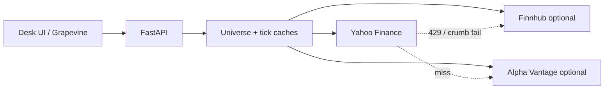
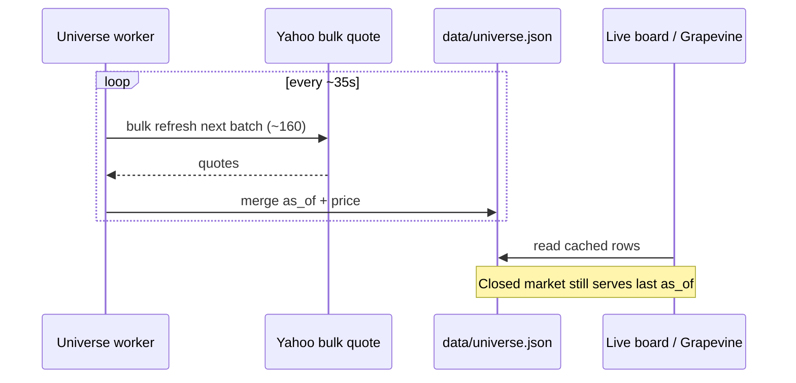

# Rate limits & how Infobroker avoids them

Infobroker talks to **Yahoo Finance** (primary), optional **Finnhub** / **Alpha Vantage**, and broker APIs. Free tiers punish aggressive polling. This doc explains the limits we design around and the strategies in code.

Also available in the desk: **Settings → Docs → Rate limits**.

## Threat model



If every browser poll hit Yahoo directly, the desk would burn the free quota in minutes. **Caches and rotation are the product.**

## Provider limits (practical)

| Provider | Typical free constraint | Infobroker stance |
|----------|-------------------------|-------------------|
| **Yahoo** (yfinance / chart / quote APIs) | Soft rate limits, crumb/cookie auth, IP bans on hammering | Primary; bulk + rotate + shared tick cache |
| **Finnhub** | ~60 REST calls/min on free tier (plan-dependent) | Backup only; not used for full-universe batches |
| **Alpha Vantage** | Very low (often ~5 calls/min free) | Single-symbol / explicit enrich only |
| **Alpaca / Public / Tradier** | Broker API quotas | Used for orders/account — not for universe scan |

Exact Yahoo numbers are undocumented and change; treat them as **“don’t hammer.”**

## How Infobroker avoids rate limits

### 1. Universe quote cache (biggest win)

- Listings sync from NASDAQ Trader (~daily).
- Background worker refreshes quotes in **rotating batches** (~160 symbols / ~35s cycle, capped at 400/batch).
- Live board, movers, Grapevine `get_prices` read **`data/universe.json`** — not a new Yahoo call per tile.



**Code:** `infobroker/universe/engine.py` (`_WORKER_INTERVAL_SEC`, `_DEFAULT_BATCH`, `refresh_quotes`).

### 2. Shared live-tick throttle

- `/api/tick/{symbol}` and SSE streams use a **per-symbol server cache**.
- US open: reuse tick for ~**0.85s**.
- US closed: ~**12s** (no need to spam overnight).

Many browser tabs share one Yahoo fetch.  
**Code:** `infobroker/markets/realtime.py`.

### 3. Bulk Yahoo before per-symbol

Quote refresh prefers a **bulk** Yahoo pull for the batch, then falls back to per-symbol only for misses — fewer round trips than N independent downloads.

### 4. Crumb/session reuse

Yahoo quote endpoints need cookie + crumb. Infobroker caches the session and refreshes once on auth failure instead of re-authing every symbol.  
**Code:** `infobroker/data/highlights.py` (`_yahoo_auth`).

### 5. Provider cascade (not parallel spam)

```
Yahoo → (miss) Finnhub → (explicit) Alpha Vantage
```

Alpha Vantage is **not** used for universe batches. Finnhub is budgeted as backup.  
**Code:** `infobroker/data/multisource.py` (`fetch_snapshot_multisource`).

### 6. Grapevine stays light

| Path | Behavior |
|------|----------|
| Desk snapshot | Universe movers only — **no** Yahoo fan-out |
| `get_prices` / watchlist quotes | Cache first; `refresh_missing` opt-in |
| `find_opportunities` | Small symbol set + **~3 min** result cache |
| Fast-path Q&A | No Ollama / no network for common questions |
| Assistant API | Runs in `asyncio.to_thread` so live board isn’t blocked |

### 7. Client-side discipline

- Live board auto-refresh is paced; closed markets slow down.
- Screenshot (“Send view”) captures the **active panel**, not the whole document.
- Coach overlays don’t auto-spam tab reloads.

### 8. Retries with backoff

Single-symbol market helpers retry a few times with short sleeps — not tight spin loops.  
**Code:** `infobroker/data/market.py` (`_retry`).

## What still costs quota

| Action | Cost | Tip |
|--------|------|-----|
| **Fill quotes / Refresh quotes** | Large Yahoo batch | Use sparingly when cache is cold |
| Chart studio / analyze / backtest | History download per symbol | Cache locally; don’t spam date ranges |
| `get_tracked` (assistant) | Live Yahoo batch for watchlist | Prefer `get_watchlist_quotes` |
| Finnhub news / optional keys | Counts against Finnhub | Leave unset if unused |

## Recommended operating posture

1. Let the universe worker fill quotes in the background.
2. Prefer Movers / Live board over “Refresh quotes” loops.
3. Keep `INFOBROKER_DATA_PROVIDER=yahoo`; add Finnhub only as backup.
4. Don’t enable aggressive auto-hunt + full scans while also hammering Fill quotes.
5. When US is closed, trust cached `as_of` prices — Grapevine already does.

## Related

- [DATA.md](DATA.md) — pipeline overview  
- [ARCHITECTURE.md](ARCHITECTURE.md) — package layout + mermaid stack  
- [BROKERS.md](BROKERS.md) — provider ranking  
